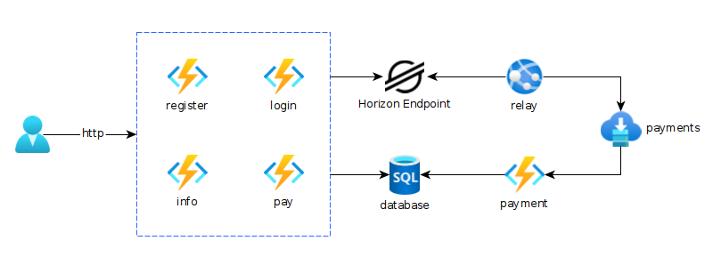

# Stellar Accounts as as Service

Stellar Account as as Service create for [Stellar Quest Bounties](https://github.com/tyvdh/stellar-quest-bounties/).
Simple custodial wallet service using muxed accounts for managing user payment transactions.

The implementation is targeted for Microsoft Azure making use of it's service offerings.



The overall architecture is composed of:

- **API Functions (register, login, info and pay)**, accessed by the user using HTTP requests
- **Horizon Testnet Endpoint**, for accessing ledger data and sending transactions
- **Relay App Service**, for streaming and relaying payment operations targeted for the custodian account and more specific the users muxed account
- **Payments Service Bus Queue**, for handling messaging between relay and function logic
- **Payment Function**, for handling payment events targeted for muxed accounts
- **Azure SQL Database**, for storing the application data

## Usage

🚀 Demo installation for the service available in:

- API endpoint: https://func-1ab85fe6.azurewebsites.net/api
- Relay status: https://app-1ab85fe6.azurewebsites.net

Easiest way around for testing the demo service is to use the provided Postman [collection](./postman_collection.json).

### User APIs

See description of the APIs in the bounty [description](https://github.com/tyvdh/stellar-quest-bounties/blob/main/bounties/level-2/stellar-accounts-as-a-service.md).

### Relay status

The relay service provides a simple JSON status endpoint giving a simple insight of the Stellar payment stream relay status.

Example response:

```
{
  "account_id": "GAMLLORKHRKYR2ODW23RKFBGXSMZLDOGUZEKN5WULD7CLUVPMGSPINM7",
  "message_count": 7,
  "record_count": 7,
  "relay_count": 1,
  "error_count": 0,
  "last_messages": [
    {
      "id": "227405633425409",
      "paging_token": "227405633425409",
      ...
    }
    ...
  ],
  "last_message_received_at": "2021-09-19T13:36:31.169Z",
  "last_message_relayed_at": "2021-09-19T13:36:32.032Z",
  "last_paging_token": "227405633425409"
}
```
